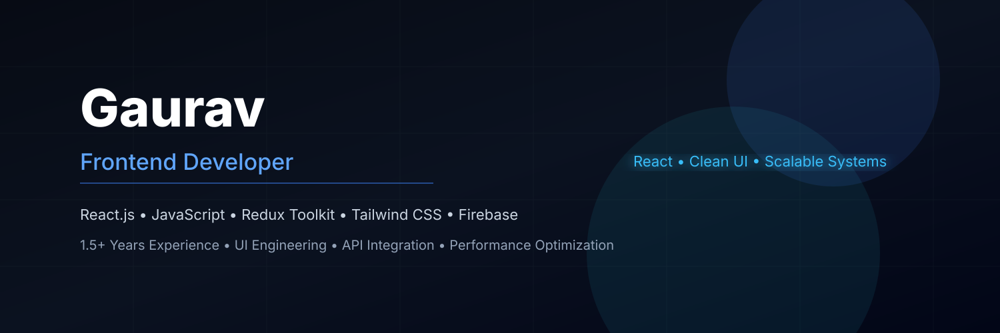

  

# Hi, I'm Gaurav 👋

## Frontend Developer

Frontend Developer with **1.5+ years of experience** building responsive and scalable web applications using **React.js, JavaScript (ES6+), Redux Toolkit, and Tailwind CSS**.

I focus on building **clean UI, scalable frontend architecture, and high-performance web applications** with seamless API integration.

---

## ⚙️ Tech Stack

**Frontend**
React.js • JavaScript (ES6+) • HTML5 • CSS3 • Redux Toolkit • Tailwind CSS • React Router • jQuery

**Tools**
Git • GitHub • Firebase • REST APIs • VS Code • Chrome DevTools

---

## 💼 Experience

### Frontend Developer — Hocalwire Labs Pvt. Ltd.
**July 2022 – Nov 2023**

- Built responsive CMS-based web applications using React.js
- Developed reusable and scalable UI components
- Integrated REST APIs for dynamic features
- Improved performance and resolved frontend issues
- Worked in Agile team environment with designers and backend developers

---

## 🚀 Featured Projects

### 🎬 NetflixGPT
AI-powered movie recommendation app using React and GPT-based APIs

- Firebase Authentication
- TMDB API integration
- Redux Toolkit state management
- Modular React architecture

🔗 https://github.com/Gola1998/Netflix-GPT

---

### 🍔 FoodFlick
Food ordering web application with live API integration

- Real-time restaurant data using Swiggy API
- Redux Toolkit for state management
- Responsive UI with Tailwind CSS
- Component-based architecture

🔗 https://github.com/Gola1998/Foodflick

---

## 📊 GitHub Stats

  

  

---

## 🔥 Currently Learning

- Next.js
- TypeScript
- System Design Basics
- Performance Optimization

---

## 📫 Connect With Me

- Email: gol8011@gmail.com  
- LinkedIn: https://www.linkedin.com/in/gaurav-gola-333498301/  

---

⭐ *Frontend Developer focused on building clean, scalable, and high-performance web applications.*
